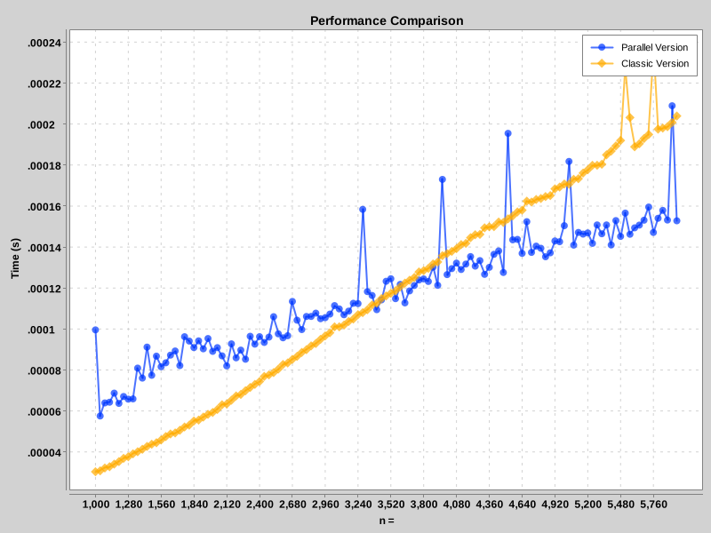
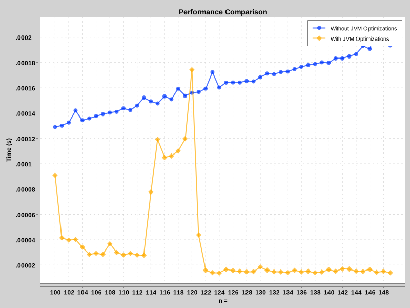

This project aims to compare the performance of algorithms (e.g., Merge Sort) using a classic sequential approach versus a parallelized implementation with Java's Fork/Join framework.

It includes a basic function benchmarking utility: functions are timed for batches of generic input values (as long as the values implement the Comparable interface, allowing them to be sorted). Execution times are plotted against the size of the input values.

This project is essentially a sandbox where I experiment with various Java features: generics, parallelism, reflection...

# Some Results

All arrays are sorted in decreasing order (O(nlog(n) for a Merge Sort).

## Fork/Join performance overhead
**graphData(1000,6_000,40,MergeSortTask.parallel, MergeSortTask.classic);** 

With constants :
    WARMUP_RUNS = 10;
    MEASUREMENT_RUNS = 15;
    WARMUP_FUNCTION = 10;

Here, we graph the execution times of a classic Merge Sort algorithm for array lengths ranging from 1,000 to 6,000, with a step size of 40.

The blue curve represents the execution times of the parallel implementation using the Fork/Join Framework, while the orange curve corresponds to the classical sequential approach.

We observe that the parallel implementation outperforms the sequential approach for larger array sizes. However, for smaller arrays, the overhead of initializing the parallelization outweighs the performance gains from dividing the task into parallel sub-tasks.

## JVM Optimizations
**graphData(100,150,1,MergeSortTask.classic);**

Here, we graph the execution times of a classic Merge Sort algorithm for array lengths ranging from 100 to 150.

First, we run the code without JVM optimizations by using the -Xint parameter before executing the JAR. Then, we run the code with the Java JIT (Just-In-Time) compiler enabled, which optimizes the execution.

Not only do the JVM optimizations improve runtime performance, but they also demonstrate how effectively the JVM optimizes repetitive tasks. Even for larger arrays, the execution time decreases significantly due to these optimizations.